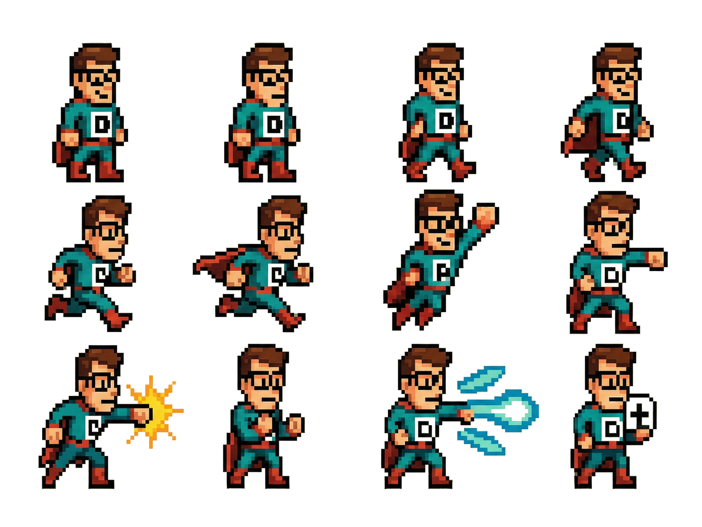
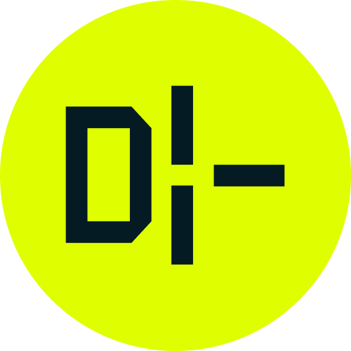
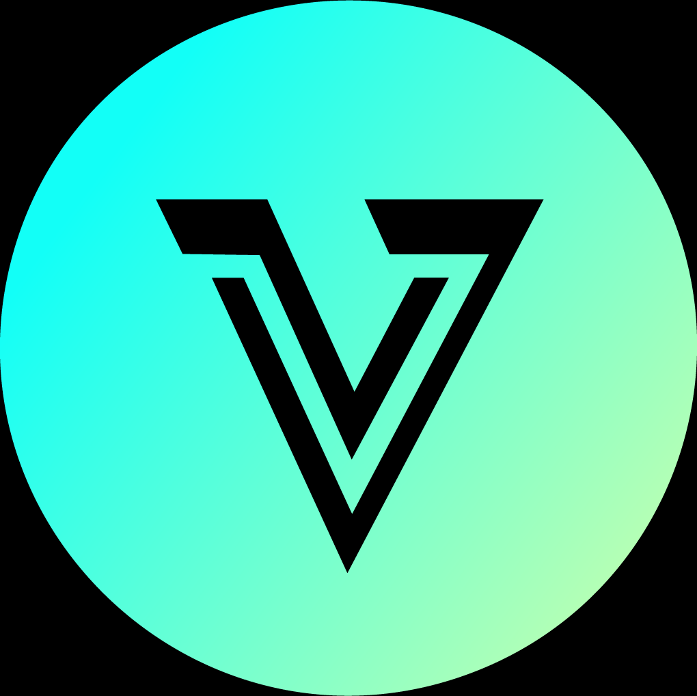

<table width="100%">
  <tr>
    <td width="50%"></td>
    <td width="50%"></td>
  </tr>
</table>

# Petri Lahdelma

**Design Systems Lead @ SAP Build Apps · Founder of [VertaaUX.ai](https://vertaaux.ai)**

I build production-grade design systems and AI-powered developer tools. 20 years turning messy requirements into resilient platforms that teams actually want to build on.

---

## Start Here

#### 🤖 [Ask ChatGPT for a summary of my background + projects](https://chatgpt.com/s/t_697692d741e8819185f05f5751611e35)

| What                          | Link                                                                                                              |
| ----------------------------- | ----------------------------------------------------------------------------------------------------------------- |
| 🤖 AI-powered reply generator | [notcringe](https://github.com/PetriLahdelma/notcringe) — [Live demo](https://notcringe.vercel.app)               |
| 🎨 Portfolio + design system  | [digitaltableteur](https://github.com/PetriLahdelma/digitaltableteur) — [Live site](https://digitaltableteur.com) |

---

## What I Work On

**Personal site @ [petrilahdelma.com](https://petrilahdelma.com)**
Selected work, systems thinking, and notes on design tooling and AI.

**Design Systems @ [Digitaltableteur](https://digitaltableteur.com)**
Production-grade components, design-to-code alignment, DesignOps governance. Daily stack: Claude Code, Figma, Storybook, React/TypeScript.

**AI-Powered UX Auditing @ [VertaaUX.ai](https://vertaaux.ai)**
Founder. API-first platform for automated accessibility and UX audits. Async pipelines, LLM-assisted analysis, CI integrations.

---

## Proof of Work

| Project                                                                   | What It Demonstrates                                                          | Evaluate                               |
| ------------------------------------------------------------------------- | ----------------------------------------------------------------------------- | -------------------------------------- |
| **[notcringe](https://github.com/PetriLahdelma/notcringe)**               | Full-stack AI: LLM integration, streaming, prompt engineering, safety filters | [Try it](https://notcringe.vercel.app) |
| **[digitaltableteur](https://github.com/PetriLahdelma/digitaltableteur)** | 50+ component design system, i18n, Storybook, Playwright, Sentry              | [Live](https://digitaltableteur.com)   |
| **VertaaUX.ai**                                                           | API-first AI platform, async pipelines, CI integrations, usage metering       | [Product](https://vertaaux.ai)         |
| **SAP Build Apps DS**                                                     | Enterprise design system at scale, governance, cross-team alignment           | Reference on request                   |

---

## How I Think

- **Systems > pixels**: Components that compose, not one-off designs
- **Deterministic foundations + probabilistic AI**: Type safety where it matters, LLMs where they help
- **Ship > theorize**: Working software beats slide decks

---

## Contact

📧 [mail@digitaltableteur.com](mailto:mail@digitaltableteur.com)
🔗 [LinkedIn](https://linkedin.com/in/petrilahdelma)

Open to: Design Systems, AI/LLM tooling, Frontend Architecture roles
