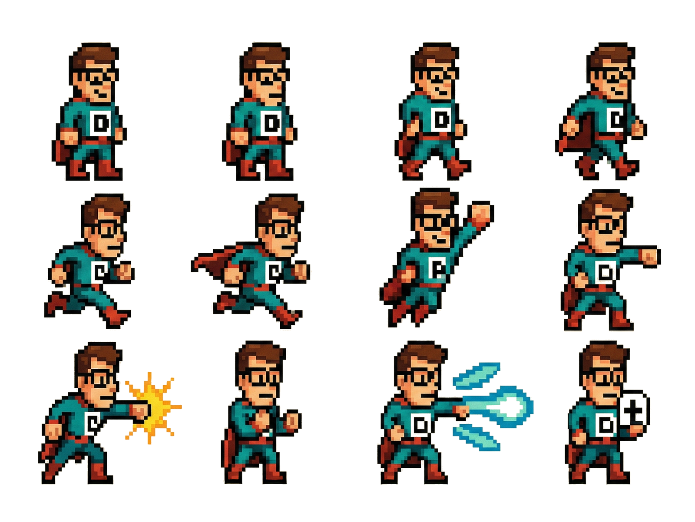
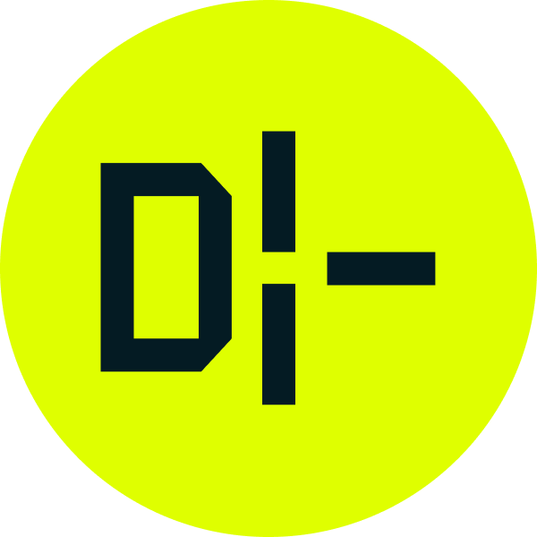

<table width="100%">
  <tr>
    <td width="50%"></td>
    <td width="50%"></td>
  </tr>
</table>

# Petri Lahdelma

**Design Systems @ Digitaltableteur · Founder of [VertaaUX.ai](https://vertaaux.ai)**

I build production-grade design systems and AI-powered developer tools. 20 years turning messy requirements into resilient platforms that teams actually want to build on.
---
<strong>20 years in Design</strong> · Design Systems · React/TypeScript · AI workflow tooling · A11y · Storybook · Figma-to-code · Design Ops and DS Governance
---

## About

I lead design systems and frontend architecture, and I ship practical AI tooling for product teams.

- 20 years in Design + Design Systems. Self taught in development.
- Design Systems @ Digitaltableteur
- Founder of VertaaUX.ai (AI-powered UX and accessibility auditing)

**Optional deep summary:** 🤖 [Ask ChatGPT for my background + projects](https://chatgpt.com/s/t_697692d741e8819185f05f5751611e35)

## What I Work On

<table width="100%">
  <tr>
    <td width="50%" valign="top">
       
      <strong>Personal site @ <a href="https://petrilahdelma.com">petrilahdelma.com</a></strong> 
      Selected work, systems thinking, and notes on design tooling and AI.  
      
      
      
    </td>
    <td width="50%" valign="top">
       
      <strong>Design Systems @ <a href="https://digitaltableteur.com">Digitaltableteur</a></strong> 
      Production-grade components, design-to-code alignment, and DesignOps governance. Daily stack: Claude Code, Figma, Storybook, React/TypeScript.  
      
      
      
    </td>
  </tr>
  <tr>
    <td width="50%" valign="top">
       
      <strong>AI-Powered UX Auditing @ <a href="https://vertaaux.ai">VertaaUX.ai</a></strong> 
      Founder. API-first platform for automated accessibility and UX audits. Async pipelines, LLM-assisted analysis, CLI + CI integrations.  
      
      
      
    </td>
    <td width="50%" valign="top">
       
      <strong><a href="https://github.com/PetriLahdelma/stylelint-plugin-rhythmguard">Stylelint Plugin Rhythmguard</a></strong> 
      Token governance for CSS and Tailwind: enforce spacing scales, require design tokens, and catch arbitrary values before they ship.  
      
      
    </td>
  </tr>
</table>

---

## Proof of Work

| Project                                                                   | What It Demonstrates                                                          | Evaluate                               |
| ------------------------------------------------------------------------- | ----------------------------------------------------------------------------- | -------------------------------------- |
| **[notcringe](https://github.com/PetriLahdelma/notcringe)**               | Full-stack AI: LLM integration, streaming, prompt engineering, safety filters | [Try WIP](https://notcringe.vercel.app) |
| **[digitaltableteur](https://github.com/PetriLahdelma/digitaltableteur)** | 50+ component design system, i18n, Storybook, Playwright, Sentry              | [Visit](https://digitaltableteur.com)   |
| **[VertaaUX.ai](https://vertaaux.ai)**                                    | API-first AI platform, async pipelines, CI integrations, usage metering       | [Product](https://vertaaux.ai)         |
| **[SAP Build Apps DS](https://www.sap.com/design-system/)**               | Enterprise design system at scale, governance, cross-team alignment           | NDA                   |

---

## Recent Shipped Work

_Last updated: <!-- LATEST_SHIPPED_TIMESTAMP_START -->2026-05-19 08:00 UTC<!-- LATEST_SHIPPED_TIMESTAMP_END -->_

<table width="100%">
  <thead>
    <tr>
      <th align="left">Project</th>
      <th align="left">Current shipped signal</th>
    </tr>
  </thead>
  <tbody>
<!-- LATEST_SHIPPED_START -->
    <tr>
      <td><strong><a href="https://vertaaux.ai">VertaaUX.ai</a></strong></td>
      <td>AI UX + accessibility auditing platform: v4.3 commercial experimentation shipped, v4.5 design-system maturity in flight, and multi-surface distribution across web, CLI, MCP, API, GitHub Action, editor/browser extensions, Figma, SDK, and PWA.</td>
    </tr>
    <tr>
      <td><strong><a href="https://dsharp.fi">DSharp Design System</a></strong></td>
      <td>Client design system delivery for the DSharp platform: 112 React components, 0 alpha components, z-index token scale, reduced-motion verification, Storybook governance, and MCP/CLI sidecars for agent-safe consumption.</td>
    </tr>
    <tr>
      <td><strong><a href="https://petrilahdelma.com">petrilahdelma.com</a></strong></td>
      <td>Personal design-systems and AI workflow site with work case studies, writing, glossary, toolbox downloads, contact flows, analytics, and SEO automation.</td>
    </tr>
    <tr>
      <td><strong><a href="https://seppo.io">Seppo AI consultancy</a></strong></td>
      <td>Client MVP and Storybook system for gamified training: Kesko / EY pilot shell, onboarding flow, board progression, AI-assisted exercise generation, result moments, and white-label theming.</td>
    </tr>
    <tr>
      <td><strong><a href="https://digitaltableteur.com">Digitaltableteur</a></strong></td>
      <td>Design systems consultancy surface for production-grade components, design-to-code alignment, AI-assisted DesignOps, and practical systems writing.</td>
    </tr>
    <tr>
      <td><strong><a href="https://github.com/PetriLahdelma/stylelint-plugin-rhythmguard">Stylelint Plugin Rhythmguard</a></strong></td>
      <td>Token governance for CSS and Tailwind: v1.6.0 shipped with Audit 2.0 design-system drift reporting.</td>
    </tr>
<!-- LATEST_SHIPPED_END -->
  </tbody>
</table>

---

## How I Think

- **Systems > pixels**: Components that compose, not one-off designs
- **Deterministic foundations + probabilistic AI**: Type safety where it matters, LLMs where they help
- **Ship > theorize**: Working software beats slide decks

---

## Open-Source Tools

| Tool                                                                 | Type              | Quickstart                                                                                          | Links                                                                                              |
| -------------------------------------------------------------------- | ----------------- | --------------------------------------------------------------------------------------------------- | -------------------------------------------------------------------------------------------------- |
| **[it-seems-fine-linter](https://github.com/PetriLahdelma/it-seems-fine-linter)** | CLI               | `npx it-seems-fine-linter --paths src`                                                               | [npm](https://www.npmjs.com/package/it-seems-fine-linter)                                          |
| **[works-on-my-machine-badge](https://github.com/PetriLahdelma/works-on-my-machine-badge)** | GitHub Action     | `uses: PetriLahdelma/works-on-my-machine-badge@v0`                                                   | [Marketplace](https://github.com/marketplace/actions/works-on-my-machine-badge)                   |
| **[breakpoint-collage-diff](https://github.com/PetriLahdelma/breakpoint-collage-diff)** | CLI               | `npx breakpoint-collage-diff --url https://example.com`                                              | [npm](https://www.npmjs.com/package/breakpoint-collage-diff)                                       |
| **[a11y-safe-autofix](https://github.com/PetriLahdelma/a11y-safe-autofix)** | CLI               | `npx a11y-safe-autofix --paths .`                                                                    | [npm](https://www.npmjs.com/package/a11y-safe-autofix)                                             |
| **[social-preview-doctor](https://github.com/PetriLahdelma/social-preview-doctor)** | CLI + Action      | `npx social-preview-doctor https://example.com` / `uses: PetriLahdelma/social-preview-doctor@v0`     | [npm](https://www.npmjs.com/package/social-preview-doctor) • [Marketplace](https://github.com/marketplace/actions/social-preview-doctor) |
| **[audiodiff-report](https://github.com/PetriLahdelma/audiodiff-report)** | CLI               | `npx audiodiff-report before.wav after.wav --format html --out ./audiodiff`                          | [npm](https://www.npmjs.com/package/audiodiff-report)                                              |
| **[vf-web-kit](https://github.com/PetriLahdelma/vf-web-kit)**          | CLI               | `npx vf-web-kit path/to/font.ttf --content \"./content/**/*.{html,md,mdx,tsx}\" --out ./dist/fontkit` | [npm](https://www.npmjs.com/package/vf-web-kit)                                                    |

---

## Contact

📧 [mail@digitaltableteur.com](mailto:mail@digitaltableteur.com)
🔗 [LinkedIn](https://linkedin.com/in/petrilahdelma)
🤝 **Collaboration:** Available for design systems leadership, frontend architecture, and AI tooling advisory.

Open to: Design Systems, AI/LLM tooling, Frontend Architecture roles

---

## Social

Personal  

Digitaltableteur  

