# Petri Lahdelma

**Design systems leader and hands-on builder. 🚧👷**

I connect product design and frontend engineering through component libraries, design tokens, documentation and governance. My 20 years in design span enterprise systems, developer tooling and independent products.

I led the SAP Build Apps design system and built hundreds of accessible components for Helsinki Design System. Today, I work on design systems at [Digitaltableteur](https://digitaltableteur.com) and build [VertaaUX.ai](https://vertaaux.ai), an accessibility and UX auditing platform.

[Talks & writing](https://petrilahdelma.com) · [Portfolio](https://digitaltableteur.com) · [Get in touch](mailto:mail@digitaltableteur.com) · [LinkedIn](https://www.linkedin.com/in/petrilahdelma/)

 

## What I Work On

<table width="100%">
  <tr>
    <td width="50%" valign="top">
      <a href="https://petrilahdelma.com">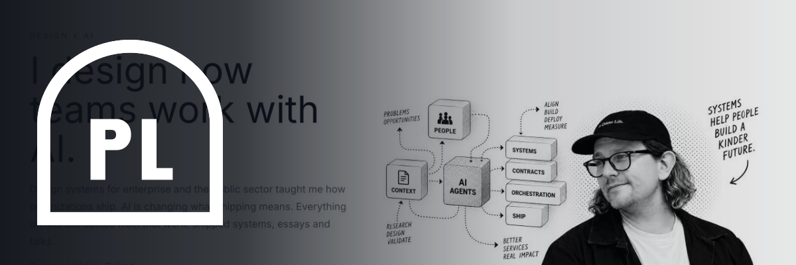</a>  
      <strong>Personal site @ <a href="https://petrilahdelma.com">petrilahdelma.com</a> 
      Focusing on design leadership and genai workflows.</strong> 
      Selected case studies, articles, talks, systems thinking and notes on design tooling and AI.  
        
      
      
      
    </td>
    <td width="50%" valign="top">
      <a href="https://digitaltableteur.com">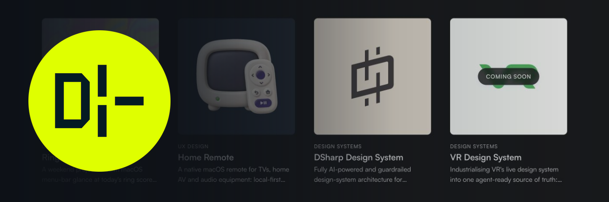</a>  
      <strong>Design Systems @ <a href="https://digitaltableteur.com">Digitaltableteur</a></strong> 
      Component libraries, design-to-code alignment, and DesignOps governance. Daily stack: Claude Code, Figma, Storybook, React/TypeScript.  
        
      
      
      
    </td>
  </tr>
  <tr>
    <td width="50%" valign="top">
      <a href="https://vertaaux.ai">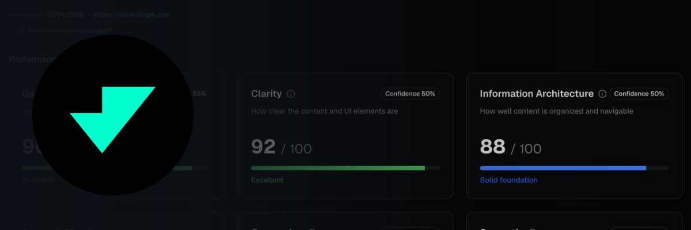</a>  
      <strong>AI-Powered UX Auditing @ <a href="https://vertaaux.ai">VertaaUX.ai</a></strong> 
      Founder. API-first platform for automated accessibility and UX audits. Async pipelines, LLM-assisted analysis, CLI + CI integrations.  
      <a href="https://vertaaux.ai">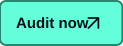</a>  
      
      
      
    </td>
    <td width="50%" valign="top">
      <a href="https://github.com/PetriLahdelma/stylelint-plugin-rhythmguard">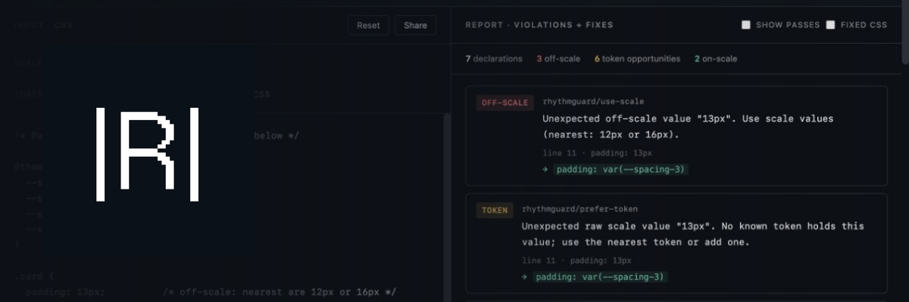</a>  
      <strong>Stylelint Plugin @ <a href="https://github.com/PetriLahdelma/stylelint-plugin-rhythmguard">Rhythmguard</a></strong> 
      Token governance for CSS and Tailwind: enforce spacing scales, require design tokens, and catch arbitrary values before they ship.  
        
      
      
      
    </td>
  </tr>
</table>

---

## Proof of Work

| Project | My role & what it demonstrates | Explore |
| --- | --- | --- |
| **[SAP Build Apps DS](https://digitaltableteur.com/work/sap-build-apps)** | Design System Lead: system architecture, component design, documentation, and Figma-to-React alignment. | [Case study](https://digitaltableteur.com/work/sap-build-apps) |
| **[Helsinki Design System / HDS](https://digitaltableteur.com/work/helsinki-design-system)** | Senior UX Designer: component design, frontend work, accessibility, and documentation for the City of Helsinki's open-source design system. | [Case study](https://digitaltableteur.com/work/helsinki-design-system) |
| **[Rhythmguard](https://github.com/PetriLahdelma/stylelint-plugin-rhythmguard)** | Creator and maintainer: CSS and Tailwind token governance, spacing checks, autofix, and drift reports. | [npm](https://www.npmjs.com/package/stylelint-plugin-rhythmguard) |
| **[VertaaUX.ai](https://vertaaux.ai)** | Founder and builder: accessibility and UX auditing across web, API, and CLI workflows. | [Product](https://vertaaux.ai) |
| **[Project Spine](https://github.com/PetriLahdelma/project-spine)** | Turns reviewed code corrections into verified regression checks and agent guidance, with Git evidence and CI enforcement. | [Product](https://projectspine.dev) |
| **[DSharp Design System](https://digitaltableteur.com/work/dsharp-design-system)** | Client design-system delivery: React components, token governance, and Storybook documentation. | [Case study](https://digitaltableteur.com/work/dsharp-design-system) |
| **BountyOps** | Governance for security research: scope and contract gates, traceable evidence, and human review. | Private |

## Independent Apps

Independent macOS apps where I explore interaction design, accessibility and local-first workflows.

| App | What I built | Try it |
| --- | --- | --- |
| **[Precedent](https://github.com/PetriLahdelma/precedent-releases)** | A local-first macOS reference workspace with on-device dictation, OCR, and source provenance. | [Download](https://github.com/PetriLahdelma/precedent-releases/releases/latest) |
| **[Ring Stats](https://github.com/PetriLahdelma/ring-stats)** | A native macOS menu-bar app for wearable metrics, with Keychain credential storage. | [Download](https://github.com/PetriLahdelma/ring-stats/releases/latest) |
| **[Home Remote](https://github.com/PetriLahdelma/home-remote-updates)** | Local TV control through a macOS app, CLI, and MCP server; built as home-tv-mcp. | [Download](https://github.com/PetriLahdelma/home-remote-updates/releases/latest) |

---

## Articles

- **[From Tokens to Thinking Systems: Making AI-Native Design Systems Actually Work](https://www.digitaltableteur.com/blog/from-tokens-to-thinking-systems-making-ai-native-design-systems-actually-work)** 
  Making component behavior, accessibility and token rules explicit enough for AI agents to use. 
  *Digitaltableteur*

- **[I audited 20 design systems for spacing drift. Here is what your team can use from it.](https://dev.to/petrilahdelma/i-audited-20-design-systems-for-spacing-drift-here-is-what-your-team-can-use-from-it-3ac7)** 
  What real repositories revealed about spacing drift, false positives and rolling out token checks without blocking teams. 
  *DEV Community*

## I ship with

  
  
  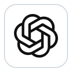
  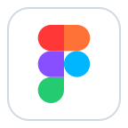
  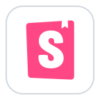
  
  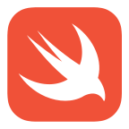

## How I Think

- **Systems > pixels**: Components that compose, not one-off designs
- **Deterministic foundations + probabilistic AI**: Type safety where it matters, LLMs where they help
- **Ship > theorize**: Working software beats slide decks

---

## Contact

**Let’s talk about your next project or design leadership role.**

Design systems, frontend architecture and AI workflows—from advisory to hands-on delivery.

  
  <a href="https://petrilahdelma.com/contact#contact-form">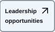</a>
  <a href="https://petrilahdelma.com/contact?intent=speaking#contact-form">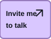</a>
  

---

## Social

Personal  

Digitaltableteur  

