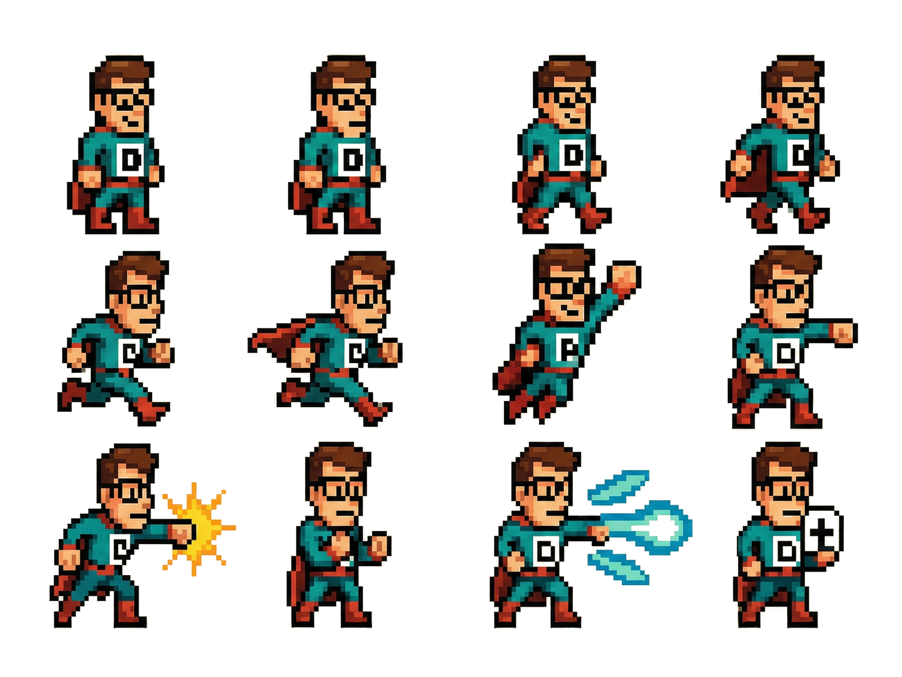

# Petri Lahdelma

**Design systems leader and hands-on builder.**

I connect product design and frontend engineering through component libraries, design tokens, documentation, and governance. My 20 years in design span enterprise systems, developer tooling and independent products.

I led the SAP Build Apps design system. Today, I work on design systems at [Digitaltableteur](https://digitaltableteur.com) and build [VertaaUX.ai](https://vertaaux.ai), an accessibility and UX auditing platform.

[Portfolio & writing](https://petrilahdelma.com) · [Get in touch](mailto:mail@digitaltableteur.com)

 

## Selected Work

### Enterprise delivery · SAP Build Apps

**Design System Lead.** My responsibilities covered system architecture, component design, documentation, and design-to-code translation, including the specification of the enterprise data table.

The work connected Figma and React components through shared tokens, accessibility requirements, Storybook documentation, and a component review and release process.

[Read the case study](https://digitaltableteur.com/work/sap-build-apps)

### Systems and tooling · Rhythmguard

**Creator and maintainer.** I built Rhythmguard to make design-system rules enforceable in CSS and Tailwind: check spacing scales, require tokens, and identify drift in code.

Autofix and audit reports turn those rules into checks developers can run locally and in CI.

[Source & documentation](https://github.com/PetriLahdelma/stylelint-plugin-rhythmguard) · [npm package](https://www.npmjs.com/package/stylelint-plugin-rhythmguard)

### Product ownership · VertaaUX

**Founder and builder.** VertaaUX brings accessibility and UX auditing into a product workflow, with a web interface, API, and CLI integrations.

My work connects the audit experience with asynchronous processing and LLM-assisted analysis, from requesting an audit to reviewing its findings.

[Explore the product](https://vertaaux.ai)

### More systems work

- **[Project Spine](https://github.com/PetriLahdelma/project-spine)** — repo-native project context, agent instructions, design-token inputs, and drift checks. [Product](https://projectspine.dev)
- **[DSharp Design System](https://digitaltableteur.com/work/dsharp-design-system)** — client design-system delivery covering React components, token governance, and Storybook documentation.
- **BountyOps (private)** — governance tooling for security research: explicit scope and contract gates, traceable evidence, and human review before submission.

## Independent Apps

| App | What I built | Try it |
| --- | --- | --- |
| **[Precedent](https://github.com/PetriLahdelma/precedent-releases)** | A local-first macOS reference workspace with on-device dictation, OCR, and source provenance. | [Download](https://github.com/PetriLahdelma/precedent-releases/releases/latest) |
| **[Ring Stats](https://github.com/PetriLahdelma/ring-stats)** | A native macOS menu-bar app for Oura metrics, with Keychain credential storage. | [Download](https://github.com/PetriLahdelma/ring-stats/releases/latest) |
| **[Home Remote](https://github.com/PetriLahdelma/home-remote-updates)** | Local TV control through a macOS app, CLI, and MCP server; built as home-tv-mcp. | [Download](https://github.com/PetriLahdelma/home-remote-updates/releases/latest) |

---

## How I Think

- **Systems > pixels**: Components that compose, not one-off designs
- **Deterministic foundations + probabilistic AI**: Type safety where it matters, LLMs where they help
- **Ship > theorize**: Working software beats slide decks

---

## Contact

📧 [mail@digitaltableteur.com](mailto:mail@digitaltableteur.com)
🔗 [LinkedIn](https://linkedin.com/in/petrilahdelma)
🤝 **Collaboration:** Available for design systems leadership, frontend architecture, and AI tooling advisory.

Open to: Design Systems, AI/LLM tooling, Frontend Architecture roles

---

## Social

Personal  

Digitaltableteur  

---

